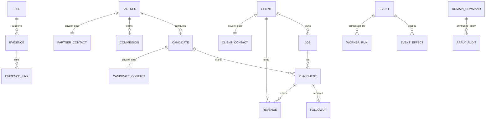

# Part 4 — Schema Overview

Status: TEST IMPLEMENTATION BASELINE

This document summarizes the PostgreSQL/Supabase target implemented during Part 4. It is not a Production cutover approval.

## Canonical schemas

- `core` — Candidate, Job, Client, Partner, Placement, Dorm, Transport, Follow-up master data
- `private` — contact/PII separated from operational core
- `privacy` — consent history and current-consent projections
- `docs` — provider-neutral File Registry / Evidence / Evidence links / storage profiles
- `ops` — event kernel, scheduler, worker dispatch, domain proposals, migration/reconciliation, closeout controls
- `finance` — operational finance, AR/AP, bank/cash, tax-document register, journal and derived accounting views
- `authz` — roles, capabilities, profiles and assignment audit
- `config` — system settings and atomic business-ID allocation
- `api` — role-scoped read projections/RPCs; no unrestricted frontend Master writer

## Identity

Canonical stable business namespace is `MYC-*` and is aligned to the current Founder Master / Data Hub configuration.

Examples:

- Candidate `MYC-C-000001`
- Job `MYC-J-000001`
- Client `MYC-B2B-0001`
- Partner `MYC-P-0001`
- Placement `MYC-PL-000001`

UUIDs are used for technical rows where appropriate but do not replace stable business IDs.

## High-level relationship map

## Write boundary

Current operational Source of Truth remains Google Sheets + Google Drive. PostgreSQL Master writes, migration apply, Production cutover and external live webhooks remain disabled by safety gates until separately approved.

## Migration model

`Google Sheets/Drive snapshot -> shadow staging -> validate -> reconcile -> delta rehearsal -> readiness checks`

Part 4G uses an isolated scratch target for cutover rehearsal. It does not switch the real writer.

## Security model

- default deny
- RLS on business/private/finance/authz tables
- private evidence/storage by default in TEST
- role-scoped API projections
- service-role-only administrative/write functions
- no secret/service key in frontend or repository

## Finance model

Revenue lifecycle:

`EXPECTED -> EARNED -> INVOICED -> COLLECTED`

Commission lifecycle:

`PENDING -> EARNED -> WAITING_COLLECTION -> PAYABLE -> PAID`

Part 4 implementation intentionally does not expose a general callable payment execution path.

## Part 4 wave mapping

- 4A — Core Master + atomic IDs
- 4B — PII / Consent / File-Evidence abstraction
- 4C — Controlled Domain Command Apply layer
- 4D — AuthZ / RLS / API projections
- 4E — Finance / Accounting foundation
- 4F — Shadow migration / reconciliation harness
- 4G — Delta / write-freeze rehearsal / cutover readiness
- 4H — Closeout / Production-readiness evidence package
